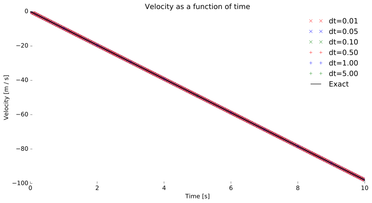
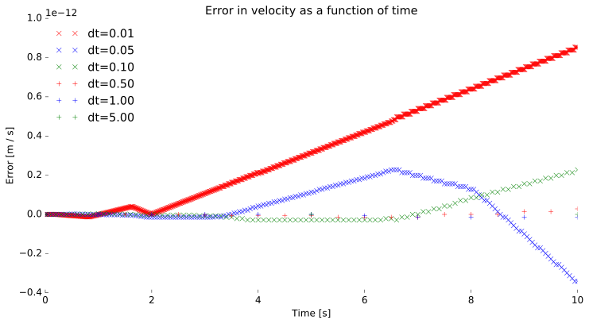
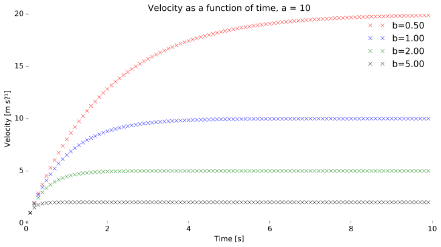
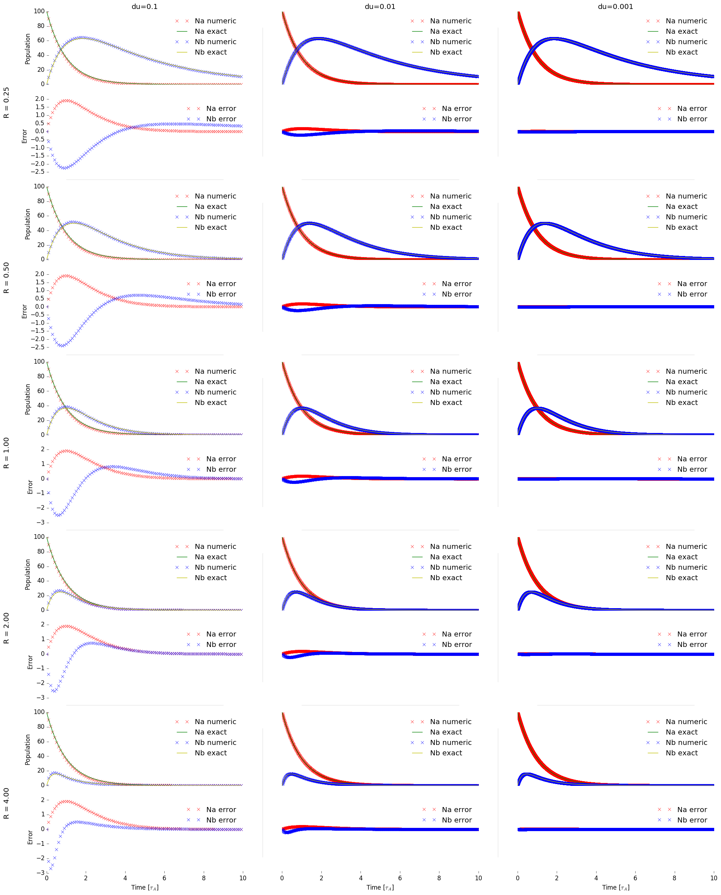
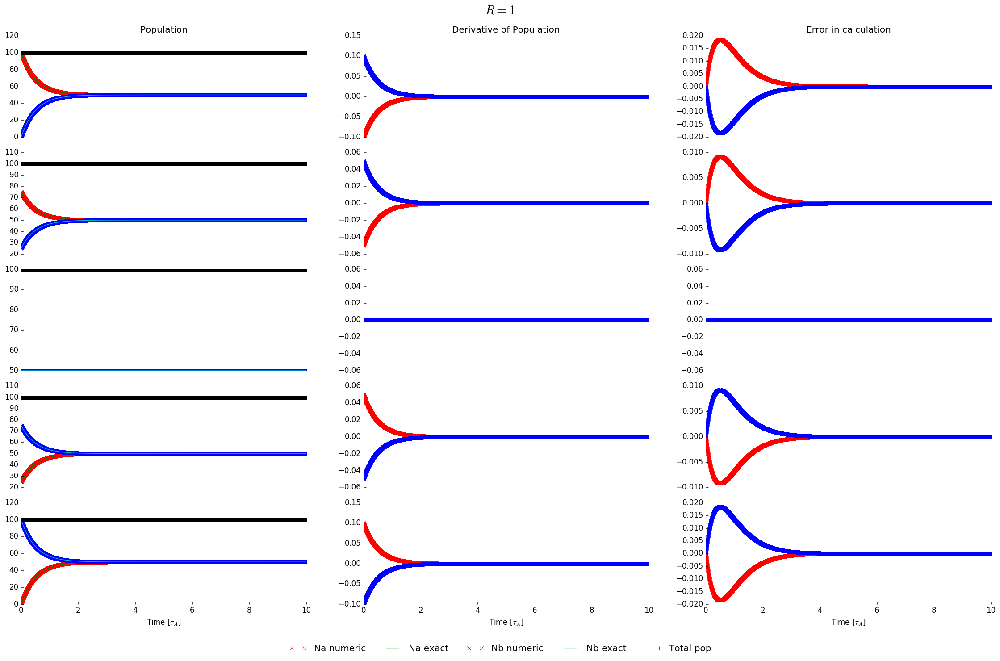

So, where to go?  I am one of those people who value a good book.  And I
do mean a physical book.  I bought and kept all of my text books
throughout my undergrad and graduate work.  That being the case, I
grabbed my undergraduate computational physics book by Nicholas J.
Giordano and Hisao Nakanishi [1] and decided to work through it again.
It is a fantastic book that covers a broad span of topics with many fun
problems that I can play with.

With that all said, I plan on working through all of the problems
starting at the beginning.  I will periodically post a selection of the
discussion of the solutions here, but some problems are trivial and
don't merit much in the way of discussion.  I will be working with
Python primarily, but I may dust of my Fortran skills for some of the
problems.  I will also be attempting to keep the code recognizable and
avoid clever tricks like list comprehensions in the physics parts.  It's
not that I don't know them (I do), I'm just trying to keep to the
basics.  Anything to do with display or I/O is fair game though.  The
code will be hosted in a [mercurial repository on Bitbucket][repo].  Why
Bitbucket and mercurial [^1] you ask?  Because it's Python.

And now for a final note before I get started.  If you are an
undergraduate using this text, go do your homework before looking over
my solutions.  It's good for you and actually quite fun.

Chapter 1
---------

And so it begins.  This will probably be a very short section because
the problems are very simple.  The chapter is simply a chance to whet
the appetite and brush up on some basics.  It will also give me a chance
to build some basic plotting tools for later.

### Problem 1

Not much to see here.  It is pretty trivial to see that the solution is
$v(t) = v(0) - g t$.  Each time step is similarly simple $t_i = i
\Delta t$.  Computing over a selection of time steps, we find

Well, that's not very interesting.  It is good to know that we can get a
good answer for this case, but what about the error?

Now, that's more interesting.  What are the final results?  I'm glad you
asked:

    Numeric       Exact      Difference
-----------  -----------  -------------
 -98.000000   -98.000000   -7.95808e-13
 -98.000000   -98.000000   -2.70006e-13
 -98.000000   -98.000000    4.26326e-14
 -98.000000   -98.000000    2.84217e-14
 -98.000000   -98.000000   -1.42109e-14
 -98.000000   -98.000000    0

We clearly see that *increasing* the time step *decreases* the error.
This is contrary to the common result where decreasing the time step
increases the accuracy.  What's going on here?  The answer is
accumulated error due to machine precision.  At each time step, we are
accumulating a fractional error.  As we take more steps from the start
to the finish, we are simply adding up all that error.  Tricks exist
that you can use to reduce the error, but they use fancy array slicing
which I am avoiding.

### Problem 2

Not much to see here, unless you didn't do problem 1.  Then it's the
exact same as above but with an opposite sign.  The accuracy is better,
but I suspect that is due to a nice multiple of 10.

### Problem 3

Now we get to something non-trivial.  Implementing the Euler method is
straight forward.  At some point, I will probably need to write a canned
routine to perform the Euler method, but that seems to be touching on
the area I want to avoid.  We'll see.  But now results.  Plotting for a
selection of $b$, we see that the terminal velocity is being reached
as expected.  A bit of manipulation reveals that terminal velocity is
when $v_t = a / b$ which is what we are seeing.  Beyond that, there
isn't really much more to say.  I know we'll come back to this in the
next chapter.

### Problem 4

And now we get to the first “challenging” problem.  Coding up the
numerical solution is straight forward.  The real challenge is in
finding the analytic solution, and I must say, I have been out of
ordinary differential equations for so long that it stumped me.  My
first attempt was guess and check.  That failed horribly.  Then, I
attempted to use a power series expansion.  That also failed.  The
correct method was to use a trial function.

We begin with the set of equations
\begin{align}
    \frac{dN_a}{du} &= -N_A \\
    \frac{dN_b}{du} &= N_A - \frac{\tau_A}{\tau_B}N_B
\end{align}
where $u = t / \tau_A$ and we define $R \equiv \tau_A /
\tau_B$.  The solution to the first equation is trivial
\begin{equation}
    N_A = N_A(0)e^{-u}.
\end{equation}
The second equation is the trickier part.  First, move $N_B$ to the
left hand side and multiply by $e^{Ru}$
\begin{align}
    e^{Ru}\frac{dN_B}{du} + (Re^{Ru})N_B &= N_A(0)e^{(R-1)u}
    \\
    \frac{d}{du}\left( e^{Ru} N_B\right) &= \frac{d}{du} 
    \left( \frac{N_A(0)e^{(R-1)u}}{R-1} \right)
\end{align}
(Quick aside: apparently, both Jekyll and MathJax strip a backslash.
Meaning, to get that line break above I had to use `\\\\\\\\`.)
Integrating both sides we find
\begin{equation}
    e^{Ru} N_B(u) = \frac{N_A(0)}{R-1} e^{(R-1)u} + C.
\end{equation}
Now, if we have a population $N_B(0)$ at time $u=0$, we can
solve for $C$ to find $C = N_B(0) - \frac{N_A(0)}{R-1}$.
Putting it all together, we find
\begin{align}
    N_A(t) &= N_A(0) e^{-t/\tau_A}
    \\
    N_B(t) &= \frac{N_A(0)}{R-1}\left(
        e^{-t/\tau_A} - e^{-t/\tau_B}
    \right) + N_B(0) e^{-t/\tau_B}
\end{align}

But wait, there's more!  We clearly see a special case when $\tau_A =
\tau_b$.  Then $R=1$ the solution is a bit different.  In this
case, we have
\begin{align}
    \frac{dN_B}{du} &= N_A(0)e^{-u} - N_B
    \\
    \rightarrow e^u \frac{dN_B}{du} + e^u N_B & = N_A(0)
    \\
    \rightarrow \frac{d}{du}\left(e^uN_B\right) &= N_A(0)
    \\
    \rightarrow N_B(u) &= \left[N_A(0)u + C\right]e^{-u}.
\end{align}
Plugging in the stated initial conditions we have
\begin{equation}
    N_B(u) = \left[N_A(0) u + N_B(0)\right] e^{-u}.
\end{equation}

Now we get to see what happens.  Below, I present a batch of plots.  In
each cell, the top figure plots the numeric and exact results for
$N_A(u)$ and $N_B(u)$ with $u=t/\tau_A$.  The bottom plot
in each cell is the error at each time step.  All figure share a common
X-axis and each row shares a Y-axis.  From left to right, we are
reducing the time step and increasing the number of iterations in the
simulation.  Going down the column, we are increasing the ratio of the
time constants $R\equiv \tau_A/\tau_B$.

The first thing that jumps out to me is that the error is fairly stable
with respect to $R$.  It does increase with a larger time constant
ratio, but it is not as large as one might expect.  We see that using a
time step of $\Delta u = 0.001$ yields fairly accurate results for
all cases.  We could increase the accuracy by increasing the number of
iterations, but I got impatient and killed the calculation.  We have
more interesting things to do!

Generally speaking, we see that the population $N_B$ has a form
similar to the Planck blackbody curve.  A quick glance at the equations
does not really reveal an specific relation.  I suspect that this is
just a random occurrence.  Many equations in physics that bear a
superficial similarity.  We also see that when $N_A$ decays faster
than $N_B$, we get a strong surge in the population of $N_B$.
This is true when both decay at the same rate as well.  I'm sure as I
stare at this figure some more, I will come up with other things to say.
But for now, I'm calling it quits.  Oh, and for estimating the short and
long term behavior, after looking at the graphs it's trivially easy.
There is a power law increase in $N_B$ and power law decrease in
$N_A$ at the early times followed by an exponential decay at long
times.

### Problem 5

And on to the next challenging problem.  First and foremost, we don't
need to go for the simplicity stated in the problem.  We can keep our
solution general and play around with the ratio of time constants.  The
first thing we need to do is recast the problem to remove the units.  To
do this, we introduce the ratio of time constant $R=\tau_A/\tau_B$
as in the previous problem.  This in turn transforms our problem int the
set of equations
\begin{align}
    f'(u) &= -f(u) + Rg(u) \\
    g'(u) &=  f(u) - Rg(u)
\end{align}
where $f$ is the population of A and $g$ is the population of B.
This is mainly to save me some typing.  Now we can turn this system of
equations over to a mathematician and get an answer!

Now for a brief aside about removing the units.  In the above equation,
we are working with a scaled time parameter $u=t/\tau_A$ and the
time constant ratio $R$.  One thing my first quantum mechanics
professor pointed out is that you *always* want to work with unitless
variables.  The scale factors you find turn out to be very important in
determining relative properties of the problem.  He mentioned this while
we were studying the simple harmonic oscillator system.  There, the
solution can be studied in a general sense simply with $x_0$ and
$p_0$.  The net result is the units are where the physics exists.

Before we get to the numeric solution, we can actually find an analytic
solution to these equations.  We don't really need it for the problem,
but it is good to evaluate the error in out solution.  Also, it gives me
a chance to brush up on my differential equations.  First, we write
$f$ in terms of $g$ and take the derivative
\begin{align}
    f &= g' + Rg 
    \\
    f' &= g'' + Rg' &= Rg - (g' + Rg)
    \\
    \rightarrow 0 &= g'' + (R+1)g'.
\end{align}
Now we introduce our proposed solution $g = e^{mu}$ and plug it in.
This gives us the equation
\begin{equation}
    m(m + R + 1) = 0
\end{equation}
with the solutions $m=0$ and $m=-R-1$.  Taking a linear
combination of the two solutions we find
\begin{align}
    g(u) & = C_1 e^{-(R+1)u} + C_2
    \\
    g'(u) &= -C_1(R+1)e^{-(R+1)u}.
\end{align}
Now, if we take $f(0) = A$ and $g(0) = B$, we can plug these in
to find
\begin{align}
    g(u) &= \frac{A - RB}{R+1} \left(1 - e^{-(R+1)u}\right) + B
    \\
    f(u) &= \frac{A - RB}{R+1} \left(R + e^{-(R+1)u}\right) + RB.
\end{align}
(The algebra isn't that hard if you really want to work through it.)
Adding these two solutions readily shows that the population at any time
is $f+g = A+B$ as expected.  Additionally, we can see the long term
behavior should be
\begin{align}
    \lim_{u\to\infty} f(u) & = \frac{R}{R+1}(A + B)
    \\
    \lim_{u\to\infty} g(u) & = \frac{1}{R+1}(A + B).
\end{align}
So, if the time constants are equal, we get equal populations in both
states.  On the other hand, if population A decays slower than B ($R >
1$), we will have a larger population is A than B.  We have no real
reason to consider the case where A decays faster than B because we can
simply get that by swapping the two states.  Now that we have the theory
and math done, let's write some code.

Well, that took longer than it should have.  The main reason was I was
trying to generate a figure with the number of steps I was using for the
number of rows and not the number of populations.  Lesson: Always make
sure you're using the correct parameters.  Stupid mistake…

On to the show!  First, we consider when the ratio of the time constants
is the same $R=1$.  Playing around with the number of steps, I found
10000 to work just fine.  The error is proportional to the number of
steps.  Doubling the number of steps used halves the error.  Below, I
present the population, derivative of the population, and the error in
each column.

Looking at this, we see that the result is boring.  The two states decay
into a state where they are exchanging member equally.  Normally, I
would propose looking at the others, but the result is the same.  Those
systems just end at a different population distribution governed by the
ratio $R$.  We do see that the numerical value of the derivative
goes to zero as expected.  Unfortunately, this problem only gave me an
exercise in debugging and creating plots.  Time to move on.

### Problem 6

And now on to the final problem of the chapter.  First off, performing
the exercise of error analysis using the $b=0$ case is pointless.
It is simply exponential growth, and we did that analysis for problems 1
and 2.  Now for a figure:

Looking at this, we see that the long term behavior of the population is
to converge to the value $N=a/b$.  This can be verified as the
expected behavior from the outset by setting the derivative to 0 and
solving for the population.  To further the analogy to a population, we
see that the population will grow until it maximizes the resources
available.  At that point, the population cannot sustain additional
growth without losing members.  On the other hand, if the population
exceeds its resources, the limited supply will force members out until
the resources can sustain the remaining population.

Conclusion
----------

With that said, we have reached the end of chapter 1.  Looking at this
post, I see that it got rather long.  To that end, I will start by
breaking the chapters into individual posts.  At some point in the near
future, I will get to work on chapter 2.

::: Note :::
Taking another look at these figures while migrating my website, I see a
major error that I admonish both my colleagues and students about: The
figures are not crafted for the target space.  Notice how hard it is to
read the labels.  This is indicative of *not* paying attention to how
the figure will be used (i.e. relying on scaling to make the figure
fit).  If the target width is 5 in., then tell your plotting utility to
generate a 5 in. figure.  If the space is 500 px, then use 500 px and
set the fonts correctly.  If your plotting utility cannot do this, get a
better plotting utility.
::::::::::::

References
----------

1.  N. J. Giordano and H. Nakanishi, *Computational Physics* (Pearson,
    Upper Saddle River, NJ, 2006), Ed. 2.

[repo]: https://bitbucket.org/kprussing/compphys
[^1]: It's a git repository now because mercurial didn't update to Python 3

